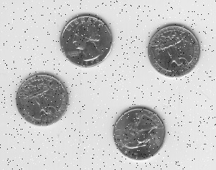
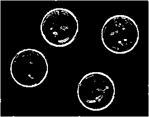

### Serial-and-Parallel-Image-Filtering

This repository contains the implementation of two filters in used widely in image processing - 

**Median Filter** - _Median Filter_ is a non-linear digital filtering technique, 
                    often used to remove noise from an image or signal. Such noise 
                    reduction is a typical pre-processing step to improve the 
                    results of later processing. Median filtering is very widely 
                    used in digital image processing because, under certain conditions,
                    it preserves edges while removing noise and works exceptionally well
                    in case of removal of Salt and Pepper Noise.
                   
**Sobel Filter** -  _Sobel Filter_ is a widely used approximation to a derivative of an image. 
                    It is separate in the y and x directions. If we look at the x-direction,
                    the gradient of an image in the x-direction is equal to this operator here. 
                    We use a kernel 3 by 3 matrix, one for each x and y direction. The gradient
                    for x-direction has minus numbers on the left hand side and positive numbers 
                    on the right hand side and we are preserving a little bit of the center pixels. 
                    Similarly, the gradient for y-direction has minus numbers on the bottom and positive
                    numbers on top and here we are preserving a little bit on the middle row pixels.

**_Steps for Execution:-_**
1. Take a `.jpg` format image and run `Medianfilter_Serial.java` and `Medianfilter_Parallel.java`.
2. Both the programs would save `.bmp` images while also output the time taken to apply the filter on whole image.
3. Now run both `readWrite-bmp.cc` and `readWrite-bmp-pthreads.cc`.
4. Similar as above resultant images will be shown with the time taken to apply the filter.
5. Ensure image name and directory paths are properly set in the programs.

    **Running above Java codes in terminal**
    - Navigate to the directory in which the program is present.
    - Enter `javac <Name-of-the-file>.java`
    - Enter `java <Name-of-the-file>`

    **Running above C++ codes in terminal**
    - Navigate to the directory in which the program is present.
    - Enter `g++ -o <Name-of-the-file> -fopenmp <Name-of-the-file>.cc`
    - Enter `./<Name-of-the-file>`
    
Note - For better observations, use images with greater number of pixels. Also its a common practice that,
       Sobel filters are used after Median filters. It would also be cool to use an image with salt and pepper noise as
       an input to Median Filter and the output of it to be used as input for sobel filter.

